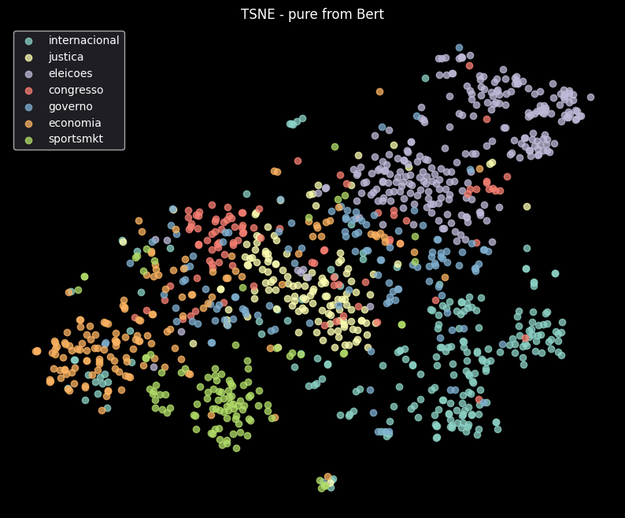
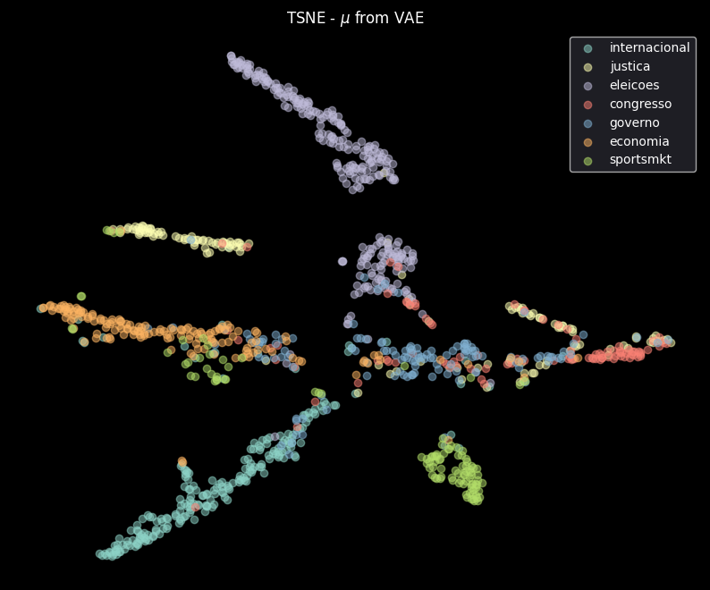

# Vector-Based Search with Variational Autoencoder Embeddings

## Introduction

In this project, we enhance a text retrieval system by leveraging embeddings generated from a Variational Autoencoder (VAE). Starting with pre-trained BERT embeddings, we fine-tune them using a VAE to better capture the semantics within a scraped news dataset. Our objective is to enrich the semantic representation of documents and queries, enabling more accurate and meaningful search results.

## Step 1: Generating Embeddings

### Dataset Description

We use the news dataset extracted using scrapping (From poder360), you can see more about this content in ``notebooks/scrapping.ipynb``. The dataset consists of content about news articles, including text and labels for subject classification. We preprocess the dataset to extract tokens and labels for classification tasks inside of VAE architecture.

### Embedding Generation Process

To generate embeddings, we start with the pre-trained BERT model (`bert-base-multilingual-uncased`). BERT provides contextualized word embeddings, which we further process using a Variational Autoencoder (VAE). The VAE comprises an encoder that maps inputs to a latent space and a decoder that reconstructs the original inputs, also we using the latent space during the training to force an another decoder that the output is a predict class. By training the VAE, we aim to capture the underlying semantic structure of the articles in a lower-dimensional space with bonus of a classifier.

**Neural Network Topology:**

- **Encoder:**
  - Pre-trained BERT model (frozen parameters)
  - Mean pooling over the last hidden states
  - Fully connected layers 
  - Sampling layer to generate latent variables (`codings`)
- **Decoder:**
  - Fully connected layers to reconstruct the original embeddings
- **Classifier:**
  - Fully connected layers to predict the sentiment label

*Figure 1: Variational Autoencoder Architecture*

### Training Process and Loss Function

We train the VAE using a combination of reconstruction loss, KL divergence loss, and classification loss. The total loss function is designed to encourage the model to learn meaningful latent representations while accurately predicting subect labels from articles.

**Loss Function:**

$$\mathbb{L_total} = \delta \mathbb{L_recon} + \beta \mathbb{L_dkl} + \gamma \mathbb{L_classification}$$

Where:

- $\mathcal{L}_{\text{recon}}$ is the reconstruction loss (Mean Squared Error) between the original embeddings and the reconstructed embeddings.
- $\mathcal{L}_{\text{KL}}$ is the Kullback-Leibler divergence loss, encouraging the latent variables to follow a standard normal distribution.
- $\mathcal{L}_{\text{class}}$ is the cross-entropy loss for classification.
- $\beta$, $\gamma$, $\delta$ are weighting factors to balance the contributions of each loss component.

**Reasoning:**

- **Reconstruction Loss ($\mathcal{L}_{\text{recon}}$):** Ensures that the decoder can accurately reconstruct the original embeddings from the latent variables, preserving semantic information.
- **KL Divergence Loss ($\mathcal{L}_{\text{KL}}$):** Regularizes the latent space to follow a normal distribution, promoting smoothness and continuity.
- **Classification Loss ($\mathcal{L}_{\text{class}}$):** Guides the latent representations to be informative for the classification task.

By combining these losses, the model learns latent embeddings that are both semantically rich and discriminative for sentiment analysis.

## Step 2: Visualizing Embeddings

To understand how our embeddings represent the dataset, we visualize them using t-SNE, projecting the high-dimensional embeddings onto a 2D space. The projection was extract from $\mu$ of the latent space. 

### Pre-trained Embeddings Visualization

*Figure 2: t-SNE Visualization of Pre-trained BERT Embeddings*

In the visualization of the pre-trained BERT embeddings, we observe that the data points are somewhat scattered without clear clustering. While BERT captures contextual information, the embeddings are not explicitly organized according to subject labels, making it challenging to distinguish each other.

### Fine-tuned Embeddings Visualization

*Figure 3: t-SNE Visualization of Fine-tuned VAE Embeddings*

After fine-tuning with the VAE, the embeddings exhibit more distinct clusters. Data points corresponding to multiple possible labels are more separated, indicating that the latent space now better captures the subject-related semantics. This separation suggests that the VAE effectively learned features relevant to the classification task during training.

## Step 3: Testing the Search System

We implemented a vector-based search system using the fine-tuned embeddings. The search system computes the cosine similarity between the query embedding and the embeddings of the dataset items to retrieve the most relevant news. We evaluate the search system using 3 different queries and analyze the search results. The tests you can see in the notebook ``notebooks/testing_endpoints.ipynb``.

## Step 4: Improving the Search System

### Reasearch Topic

In this topic, we add something new in VAE architecture to improve the search system. We add a new loss function that is the Classification Loss in the latent space. This loss function is used to force the latent space to be more informative for the classification task. The new architecture is shown in the figure below.

*Figure 4: t-SNE Visualization of Fine-tuned VAE Embeddings*

We can see that the latent space is more informative for the classification task, which can help the search system to retrieve more relevant news articles. It can be explained by the fact that the latent space is more organized and the data points are more separated, which can help the search system to better distinguish between different classes. Also, the output from search system is more accurate and meaningful demonstrating consistent about labels too, you can see more about this in the notebook ``notebooks/testing_endpoints.ipynb``.

### Entrepreneur

I spoke with a journalism-focused startup and presented a proof of concept (POC) that they validated, expressing interest in two specific services they currently lack:

1. A **news classifier** to automate the process of categorizing articles, which is currently done manually by one or two interns. This automation would alleviate a key pain point for them, as the manual process is both time-consuming and labor-intensive. The interest shown by the startup underscores the value of this feature, as it addresses a clear operational need.

2. A **search mechanism** to identify previous, related articles that could provide contextual support for the content being produced. Although they already have an automated content production system, this tool would enable the system to pull from existing material, offering a broader contextual window and facilitating content reuse.

Both the classifier and the search functionality were well-received and seen as effective solutions aligned with the startup’s business goals, potentially enhancing their content production efficiency significantly.

### Deployment

The system was deployed using FastAPI, the models ``.pth`` was deployed on hugging face [you can acces here](https://huggingface.co/xValentim/vector-search-bert-based/tree/main). The API was deployed on Railway, you can access the API [here](https://vector-search-bert-based-production.up.railway.app/docs).