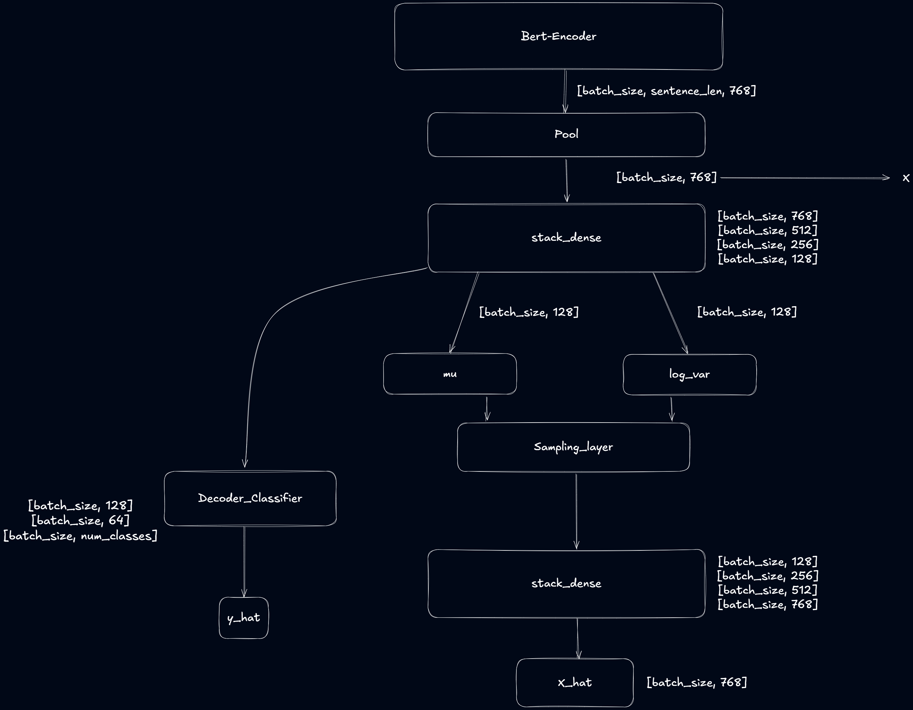
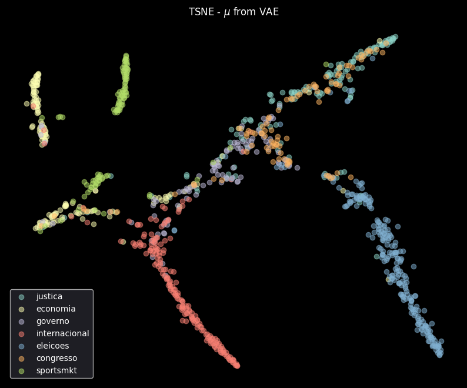

# Vector-Based Search with Variational Autoencoder Embeddings

## Introduction

In this project, we enhance a text retrieval system by leveraging embeddings generated from a Variational Autoencoder (VAE). We start with pre-trained BERT embeddings and fine-tune them using a VAE to better capture the semantics of movie reviews from the scrapping news dataset. Our goal is to improve the semantic representation of documents and queries, enabling more accurate and meaningful search results.

## Step 1: Generating Embeddings

### Dataset Description

We use the scrapping news dataset, you can see more about this content in ``notebooks/scrapping.ipynb``. The dataset consists of content about news articles, including text and labels for subject classification. We preprocess the dataset to extract tokens and labels for classification tasks.

### Embedding Generation Process

To generate embeddings, we start with the pre-trained BERT model (`bert-base-multilingual-uncased`). BERT provides contextualized word embeddings, which we further process using a Variational Autoencoder (VAE). The VAE comprises an encoder that maps inputs to a latent space and a decoder that reconstructs the original inputs. By training the VAE, we aim to capture the underlying semantic structure of the reviews in a lower-dimensional space. Also, we training a classifier to predict label from news articles together with the VAE. 

**Neural Network Topology:**

- **Encoder:**
  - Pre-trained BERT model (frozen parameters)
  - Mean pooling over the last hidden states
  - Fully connected layers with residual connections
  - Sampling layer to generate latent variables (`codings`)
- **Decoder:**
  - Fully connected layers to reconstruct the original embeddings
- **Classifier:**
  - Fully connected layers to predict the sentiment label

*Figure 1: Variational Autoencoder Architecture*

### Training Process and Loss Function

We train the VAE using a combination of reconstruction loss, KL divergence loss, and classification loss. The total loss function is designed to encourage the model to learn meaningful latent representations while accurately predicting sentiment labels.

**Loss Function:**

\[
\mathcal{L}_{\text{total}} = \delta \times \mathcal{L}_{\text{recon}} + \beta \times \mathcal{L}_{\text{KL}} + \gamma \times \mathcal{L}_{\text{class}}
\]

Where:

- \(\mathcal{L}_{\text{recon}}\) is the reconstruction loss (Mean Squared Error) between the original embeddings and the reconstructed embeddings.
- \(\mathcal{L}_{\text{KL}}\) is the Kullback-Leibler divergence loss, encouraging the latent variables to follow a standard normal distribution.
- \(\mathcal{L}_{\text{class}}\) is the binary cross-entropy loss for sentiment classification.
- \(\beta\), \(\gamma\), \(\delta\) are weighting factors to balance the contributions of each loss component.

**Reasoning:**

- **Reconstruction Loss (\(\mathcal{L}_{\text{recon}}\)):** Ensures that the decoder can accurately reconstruct the original embeddings from the latent variables, preserving semantic information.
- **KL Divergence Loss (\(\mathcal{L}_{\text{KL}}\)):** Regularizes the latent space to follow a normal distribution, promoting smoothness and continuity.
- **Classification Loss (\(\mathcal{L}_{\text{class}}\)):** Guides the latent representations to be informative for the sentiment classification task.

By combining these losses, the model learns latent embeddings that are both semantically rich and discriminative for sentiment analysis.

## Step 2: Visualizing Embeddings

To understand how our embeddings represent the dataset, we visualize them using t-SNE, projecting the high-dimensional embeddings onto a 2D space. The projection was extract from \mu of the latent space. 

### Pre-trained Embeddings Visualization

*Figure 2: t-SNE Visualization of Pre-trained BERT Embeddings*

In the visualization of the pre-trained BERT embeddings, we observe that the data points are somewhat scattered without clear clustering. While BERT captures contextual information, the embeddings are not explicitly organized according to sentiment labels, making it challenging to distinguish positive and negative reviews.

### Fine-tuned Embeddings Visualization

*Figure 3: t-SNE Visualization of Fine-tuned VAE Embeddings*

After fine-tuning with the VAE, the embeddings exhibit more distinct clusters. Data points corresponding to positive and negative reviews are more separated, indicating that the latent space now better captures the sentiment-related semantics. This separation suggests that the VAE effectively learned features relevant to the classification task during training.

### Discussion

The comparison between Figures 2 and 3 highlights the impact of fine-tuning the embeddings with the VAE. The pre-trained embeddings lack clear organization concerning sentiment, while the fine-tuned embeddings show improved clustering based on sentiment labels. This improvement demonstrates that our training process successfully enhanced the embeddings to be more discriminative for our specific problem.

## Step 3: Testing the Search System

We implemented a vector-based search system using the fine-tuned embeddings. The search system computes the cosine similarity between the query embedding and the embeddings of the dataset items to retrieve the most relevant reviews.